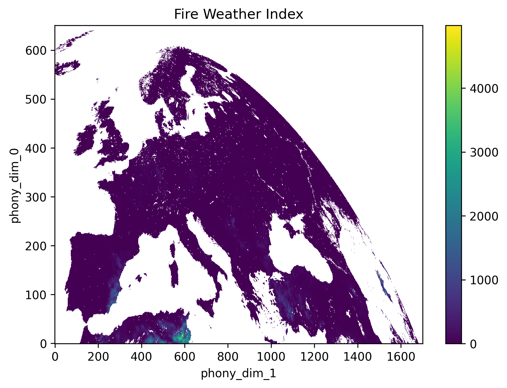
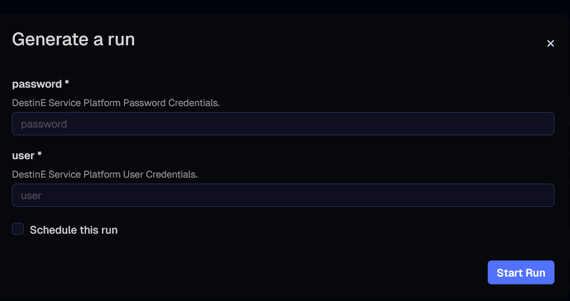

# DeltaTwin Component: Fire Weather Index forecast

This DeltaTwin component plots Fire Weather Index (FWI) forecast data as a processing service.

The most recent fire risk forecast data is taken from the [MSG fire risk map](https://data.destination-earth.eu/data-portfolio/EO.EUM.DAT.MSG.LSA-FRM) and then plotted as a png. The DeltaTwin component relies on the HDA (Harmonized Data Access) service.

## Workflow

The workflow is defined in [workflow.yml](workflow.yml) and wires workflow inputs to the model and then to the component output declared in [manifest.json](manifest.json).

The workflow defines the graph that connects inputs to the model and then to the output:

- `user` and `password` nodes reference `inputs.user` and `inputs.password`.
- The `fwi` node references `models.fwi`.
- The `plot` node references `outputs.fwi-plot`.

Edges connect the inputs to the model’s input ports and connect the model’s output port to the output node. The important wiring is:

```yaml
  - from:
      id: fwi
      port: fwi-plot
    to:
      id: plot
```

This matches the output name declared in the model definition and makes the generated PNG available as the component output.

| **Node** | **Kind** | **Description** |
| -------- | -------- | --------------- |
| user | input | DESP auth username passed to the model as the first CLI argument (`user`). |
| password | input | DESP auth password passed to the model as the second CLI argument (`password`). |
| fwi | model | The Python model that searches the HDA STAC catalog, downloads an MSG fire risk product, and generates PNG plot(s). |
| plot | output | The output node wired to `outputs.fwi-plot`, which captures the PNG(s) produced by the model. |

## Steps to build the component

### Local testing of the model

The model is implemented in [models/fwi_calculator/fwi.py](models/fwi_calculator/fwi.py) and expects two CLI arguments.

[models/fwi_calculator/fwi.py](models/fwi_calculator/fwi.py) expects two CLI arguments: `user` and `password`. These are used to set `DESPAUTH_USER` and `DESPAUTH_PASSWORD` before calling `destinepyauth.get_token()`.

To install the Python dependencies locally:

```shell
pip install -r models/fwi_calculator/requirements.txt
```

To run the model locally:

```shell
python models/fwi_calculator/fwi.py <username> <password>
```
If the run is successful, the logs will show
```
INFO FWI: Plot saved: fwi.png
```

### Build the DeltaTwin component and run it locally

DESP auth credentials are provided as input parameters in the format of a JSON file, as below.
```json
{
  "user": {
    "type": "string",
    "value": "johnsmith"
  },
  "password": {
    "type": "string",
    "value": "XXXXXX"
  }
}
```
To ease local and remote usages in this tutorial, 2 manifest files are provided:

- `manifest-local.json`: the one to be used for local run.
- `manifest-remote.json`: the one to be used to publish the component to the service.

The main difference between them is the type of the `password` parameter. For local runs, the "secret" type is not permitted, so we use "string" (as above).

To run it locally, you must first copy the relevant manifest file to the main `manifest.json` file required for the build. For example, using the following command:

```shell
cp manifest-local.json manifest.json
deltatwin run start_local -i inputs-local.json
```

If this is the first time running the command, it will also build the component’s Docker image. This process may take several minutes because the model requires GDAL packages and Python libraries to be installed in the image (see for instance manifest sections `models/[...]/pipRequirements` and `models/[...]/aptRequirements`).

This will print several log lines related to loading dependencies and building the image, the orchestrator executing workflow's steps, and finally, the status:

```
Status:RunStatus.SUCCESS
Inputs:
     Input name | Type   | Value/Basename                                                                                                         
    ------------+--------+----------------                                                                                                        
     user       | string | johnsmith                                                                                                              
     password   | string | XXXXXX                                                                                                           
Outputs:
     Output name | Type | Value/Basename                                                                                                          
    -------------+------+---------------------------------------------------------------------------                                              
     fwi-plot    | Data | /path/to/home/.deltatwin/runs/<run_id>/fwi/fwi.png 
```
The outputs of the component are stored in a temporary directory associated to the local run ID.

The resulting file `fwi.png` contains a plot similar to the one below.



### Publish component to the DeltaTwin service

Prior to publish the component to the DeltaTwin service, the relevant manifest file shall be used as main `manifest.json` file required for the build, using the following command:

```shell
cp manifest-remote.json manifest.json
```

This manifest references UUIDs of sample resources that are publicly available on the service platform.

> ⚠️ **Warning:** A current limitation of the DeltaTwin service is that all components must have a unique name across all users. Therefore, before publishing this example, you should rename the component by adding a suffix containing your username or another unique identifier, to avoid a duplicate name error.
>
> To do so, edit the `manifest.json` file by changing the value of the "name" attribute, specifically the suffix part (e.g., replacing 'myname' with your own identifier):
>
> ```json
> {
>   "name": "fwi-plotter-myname",
>   [...]
> }
> ```

Then, to publish the component to the DeltaTwin service, the following command specifies the version '0.1.0' with the 'fwi' and 'tutorial' tags.

```shell
deltatwin component publish -t fwi -t tutorial 0.1.0
```

This will print various log lines as the image is built and its layers are pushed to the service repository. The process should complete successfully with the following message:

```log
INFO: The DeltaTwin fwi-plotter-myname-0.1.0, has been released.
```

By default, the component is published with private visibility.
To list private components, use the following:

```shell
deltatwin component list -v private
```

To get more information about this specific component, use:

```shell
deltatwin component get fwi-plotter-myname
```

### Run the component on the service

There is a known issue: the CLI cannot decrypt `secret` values from `inputs.json`. If you set `type: "secret"` in the inputs file, the run fails with a `fromhex()` error. **Therefore, the fwi-plotter model cannot be run on the service using the CLI**. For service runs, publish the component and pass the secret via the UI, which handles encryption for `secret` inputs.

Once the component has been published to the service, it is ready to use. To run the component using the platform's computing resources, navigate to the [DeltaTwin UI](https://app.deltatwin.destine.eu) and follow these steps:
- login
- select `DeltaTwins` from the menu on the left
- select the component you just created `fwi-plotter-myname`
- select run in the top right
- a menu should appear as shown below for you to input your DESP credentials
- press `Start Run`



You can monitor the status of the run by selecting `Runs` from the left hand menu.
